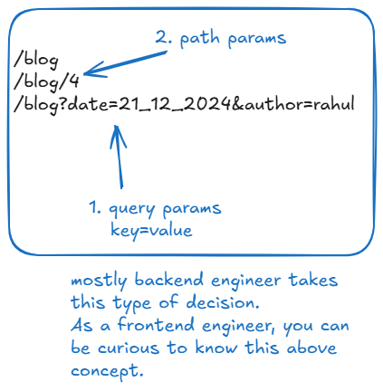
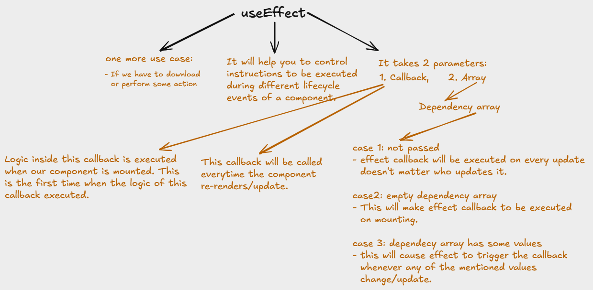

## props
props is a object, which used to access properties that are given from another component during calling the function in current component
## JSX Curly 
Curly brackets are used to access the properties of the props object
It helps to evaluate the expression by JSX curly
``` JavaScript
// Inline CSS
<button style={{'backgroundColor': 'blue', 'color': 'white'}}>
</button>
```

## JSX Fragments
You can't return multiple parent element. You can return only one single parent element.
And if you wrap up all element in single div element, you can do it but there is a problem
Problem is there is introduce extra DOM node. That extra node is irrelevant.
And every components having extra one node and in term of large scale project, this will big problem(unnecessary load). By mistake applied styling.
So, React introduce Fragments.
Help to multiple element wrapped into single
It will not create extra node
Fragment doesn't render as an element, So you can't apply styling.
``` JavaScript
<> 
</>
```

## React Principle
To help to achieve UI Components reusability 
1. Single Responsibility principle: A component should have only one reason to change or should have only one responsibility/Function
2. Presenter Container Pattern: 


## Component: Memory-Manage


* Every Components having its memory to track data.
* But it is not possible with normal variabel or local variable
* Here react introduce, state variable to check changes on component and update during run time on where required(globally)
* This will done using useState() special function or called React hooks.

## React Hooks:
* React Hooks are special functions that let you "hook into" React state and lifecycle methods from function components. It will perform designated task.
* You can't execute hook inside a callback.(useState())

# Conditional Rendering
## React Router Library:
It third party library to solve our redirection problem between multiple pages.
And achieve to single page web page rather than if you are using multiple page in your webapp.
To install:
``` bash
npm install react-router-dom
```
App component as a child to BrowserRouter.
In App component hierarchy, enable the capability of BrowserRouter hierarchy.
``` JavaScript
<BrowserRouter>
    <App />
</BrowserRouter>
```
* Routes
* Route
* Link
* useNavigate() hook: useNavigate is a hook that returns a navigate function and help to <u>condination rendering</u>
* etc...

## Given Task
* problem type: data transfer from one page to another
* Enter data in Input form, Task is to display that data on Screen after submit the data
  
* Solutions:
  
  
  ``` JavaScript
  // Query Params
  // From
  const navigate = useNavigate();
  navigate(`/play?text=${value}`);
  // To
  const [ searchParams ] = useSearchParams();
  console.log(searchParams.get("text"));
  ```
  ``` JavaScript
  // path params
  // From
  navigate(`/play/${value}`);
  // To
  const { text } = useParams();
  return (<h1>PlayGame {text}</h1>);
  // In App Component, can give multiple path params
  <Route path="/play/:text/:id" element={<PlayGame />} />
  ```
  Both above <u>query params</u> and <u>path params</u> solutions are not good for 2 player game because input will be show to other player in url.

* Third Solution is better than both above given by react-router.
  ``` JavaScript
  // From
  navigate(`/play`, { state: { wordSelected: value } });
  // To
  // using useLocation() hook function given by react-router
  const { state } = useLocation();
  ```
  Note: best solution is stateMangament (Context api)

## Rendering List

 
* Solution:
  ```JavaScript
  function Rendered() {
    const arr = ['Hello', 'World'];
    return (
      <>
         { arr.map((element, idx) => <b key={idx}>{element}</b>) }
      </>
    );
  }
  ```

# Effects and Lifecycle
## Lifecycle


## useEffect hook


NOTE

``` JavaScript
useEffect(() => {
    console.log("component first load"); // not call on updates
}, []); // passing empty dependency array

useEffect(() => {
    console.log("component first load and update");
}); // not passing dependency array

useEffect(() => {
    console.log("component first load and update value changed");
}, [value]);

useEffect(() => {
    console.log("component first load and inputType value changed");
}, [inputType]);
```

Note: The changes in a normal variable can't update the whole component.
``` JavaScript
let x = 0; 

useEffect(() => {
  console.log("component first load and x value changed");
}, [x]);

return <button onClick={() => x += 1}>Click me</button>
```

# State Management


``` JavaScript
// I save as WordContext.js
import { createContext } from "react";
// common storage
export const WordContext = createContext(null); // create a context object
```
``` JavaScript
// available to all components hierarchy by doing this
//  go to the main or app component means top component
import { WordContext } from './context/WordContext.js'
createRoot(document.getElementById('root')).render(
    <WordContext.Provider> {/* Available to all component hierarchy */}
        <BrowserRouter>
            <App />
        </BrowserRouter>
    </WordContext.Provider>
)
```
``` JavaScript
// We need to use a hook called as useContext() by calling it in 
// which component, where we require this
// First I set or store the data in it from Home component
const { setWordList } = useContext(WordContext);
async function fetchWords() {setWordList([...data])};
```
Note: You can create multiple context api depends on your requirement

### zunstand library

``` JavaScript
// create a file named WordStore.js
import { create } from 'zustand';

// use zustand state management
// create function creates a store for us
const wordStore = create((set) => ({
    wordList: [],
    word: '',
    setWordList: (list) => {
        set((state) => {
            // Whatever you return from here will be the new state
            return {
                ...state,
                wordList: list
            }
        });
    },
}));

// where we want use:-
const { setWordList } = wordStore(); 
```

## Project folder structure

