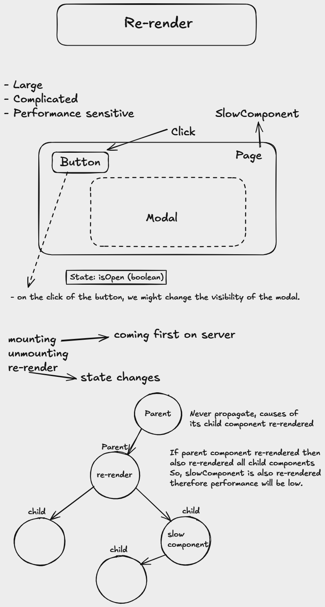

# Re-render
React automatically re-renders components whenever there is a change in their state or props and provides dynamic content in accordance with user interactions


## Custom hook
``` JavaScript
import { useState } from "react";
// custom hook
export default function useModalDialog() {
    const [ isOpen, setIsOpen ] = useState(false);
    return {
        isOpen,
        open: () => setIsOpen(true),
        close: () => setIsOpen(false)
    };
}
```